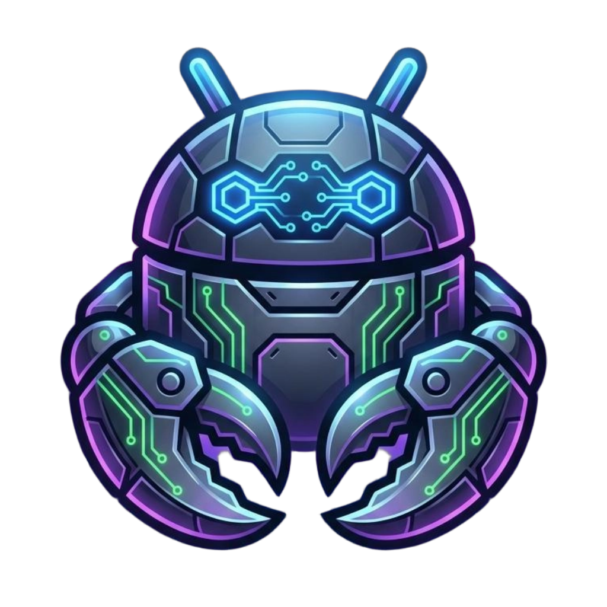
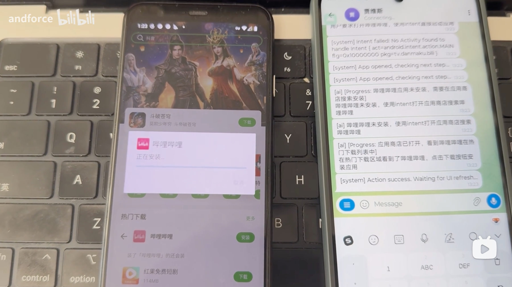

# Andclaw 🤖

<p align="center">
  
</p>

[](https://www.android.com/)
[](https://kotlinlang.org/)
[](LICENSE)

> **让 AI 像人类一样使用你的手机** —— 完全在设备上运行，无需 Root，无需电脑。

---

## 🌟 核心亮点

| 特性 | 说明 |
|------|------|
| **🚫 无需 Root** | 纯无障碍服务实现，不依赖系统权限 |
| **💻 无需电脑** | 完全在手机上独立运行，无需 ADB 或 PC 端配合 |
| **🧠 AI 驱动** | 支持 Kimi（Anthropic 格式）和任意 OpenAI 兼容 API |
| **👁️ 屏幕感知** | 实时读取 UI 层次结构 + WebView/浏览器场景自动截图辅助视觉分析 |
| **🤏 拟人操作** | 模拟点击、滑动、长按、文本输入等手势操作 |
| **📸 多媒体能力** | 拍照、录像、录屏、截图、音量控制 |
| **📱 设备管控** | Device Owner 模式下支持企业级设备管理（静默装卸、Kiosk 等） |
| **🤖 Telegram 远程控制** | 通过 Telegram Bot 远程下发指令、接收截图/录像 |

---

## 📱 演示

[](https://www.bilibili.com/video/BV1k8w4zeEL7)

---

## 🚀 快速开始

### 环境要求

- **Android 版本**: Android 12 (API 31) 或更高
- **无障碍服务**: 需要在 `设置 > 无障碍` 中手动启用
- **悬浮窗权限**: 用于显示紧急停止按钮
- **API Key**: 从 [Kimi](https://platform.moonshot.cn/) 或任意 OpenAI 兼容 API 提供商获取

### 编译/安装步骤

1. **克隆仓库**
   ```bash
   git clone https://github.com/andforce/Andclaw.git
   cd Andclaw
   ```

2. **配置 API 密钥**

   创建 `local.properties` 文件：
   ```properties
   kimi_key=your_kimi_api_key_here
   tg_token=your_telegram_bot_token  # 可选，用于 Telegram 远程控制
   ```

3. **编译安装**
   ```bash
   ./gradlew :app:installDebug
   ```

4. **授予权限**
   - 打开应用后，按提示启用**无障碍服务**
   - 授予**显示在其他应用上层**权限

5. **激活 Device Owner**

   通过 ADB 激活（仅首次设置需要），激活后 Andclaw 获得企业级设备管理能力：

   > ⚠️ **重要**：由于 Android 安全限制，设备必须先**恢复出厂设置**才能启用 Device Owner 模式。已有用户账户的设备将无法激活。

   ```bash
   adb shell dpm set-device-owner com.andforce.andclaw/.DeviceAdminReceiver
   ```

   - ✅ **应用管理**：静默安装/卸载应用、隐藏/显示/挂起应用、阻止卸载、自动授予权限、查询已安装应用列表
   - ✅ **设备控制**：远程锁屏、重启、恢复出厂设置、禁用摄像头/状态栏/锁屏、USB 数据传输控制、定位开关
   - ✅ **Kiosk 模式**：单应用锁定（Lock Task）、替换默认桌面、禁止安全模式/恢复出厂

   > 详细能力清单见 [ACTIONS.md](./ACTIONS.md)

6. **创建 Telegram 机器人**

   1. 在 Telegram 中搜索并打开 **@BotFather**
   2. 发送 `/newbot` 创建新机器人
   3. 按提示设置机器人名称和用户名（用户名必须以 `bot` 结尾）
   4. 创建成功后，复制提供的 **Bot Token**（格式如：`123456789:ABCdefGHIjklMNOpqrsTUVwxyz`）
   5. 将 Bot Token 填入 `local.properties` 的 `tg_token` 字段，重新编译安装

---

## 🎯 使用方式

### 1. 文字指令

直接告诉 Andclaw 你想做什么：

| 指令示例 | AI 执行过程 |
|---------|------------|
| "打开bilibili，搜索AI学习相关的视频，并播放" | 识别B站图标 → 点击 → 进入搜索页 → 输入"AI学习" → 点击搜索 → 选择视频 → 播放 |

### 2. AI Agent 工作循环

```
用户指令
    ↓
[1.5s] → 捕获屏幕 UI 树（无障碍服务）
    ↓
浏览器/WebView？──是──→ 自动截图（视觉分析辅助）
    ↓                          ↓
发送给 LLM（系统提示 + 最近 12 条历史 + 屏幕数据 [+ 截图]）
    ↓
AI 返回 JSON 操作决策
    ↓
解析失败？──是──→ 纠正提示重试（1 次）
    ↓
执行操作（点击/滑动/输入/Intent/DPM/拍照/录屏/...）
    ↓
[2.5s] → 重新捕获屏幕  ←──────────────┐
    ↓                                   │
循环检测（同一操作连续 5 次？）             │
    ↓是                                  │
截图 + 视觉重试（最多 3 轮，15 次后停止）    │
    ↓否                                  │
任务完成？──否──────────────────────────-─┘
    ↓
是 → 结束
```

### 3. 支持的操作类型

| 类型 | 说明 |
|------|------|
| `intent` | 启动应用/Activity，打开网页、拨号、发短信、设置闹钟等系统 Intent |
| `click` | 在屏幕坐标 (x, y) 模拟点击 |
| `swipe` | 滑动手势（滚动、翻页），支持自定义时长 |
| `long_press` | 长按，支持自定义时长 |
| `text_input` | 向当前焦点输入框注入文本（SET_TEXT → 剪贴板粘贴 fallback） |
| `global_action` | 系统级操作：返回、Home、最近任务、通知栏、快捷设置 |
| `screenshot` | 截图并保存到 `Pictures/Andclaw/`，通过 Telegram 自动发送 |
| `download` | 通过 DownloadManager 直接下载文件（无需打开浏览器） |
| `wait` | 等待页面加载/UI 过渡完成后重新检查屏幕（最长 10 秒） |
| `camera` | 拍照（`take_photo`）、开始录像（`start_video`）、停止录像（`stop_video`） |
| `screen_record` | 录屏（`start_record` / `stop_record`），保存到 `Movies/Andclaw/` |
| `volume` | 音量控制：设置、调高/调低、静音/取消静音、查询当前音量 |
| `dpm` | Device Policy Manager 操作（仅 Device Owner 模式） |
| `finish` | 任务完成，停止 Agent |

### 4. 支持的 AI 提供商

| 提供商 | API 格式 | 配置示例 |
|--------|---------|---------|
| **Kimi** | Anthropic Messages | Base URL: `https://api.kimi.com/coding`，Model: `kimi-k2.5` |
| **OpenAI 兼容** | OpenAI Chat Completions | Base URL: `https://api.openai.com/v1`，Model: `gpt-4o` |

支持多模态输入（文本 + 截图 base64），Kimi 和 OpenAI 格式均可携带图片。

### 5. Telegram 远程控制

通过 Telegram Bot 远程控制设备，启动 Andclaw 后 Telegram 机器人会自动启动。

| 命令 | 说明 |
|------|------|
| 直接发送文字 | 作为指令下发给 Agent 执行 |
| `/status` | 查询 Agent 状态（运行中/空闲、当前任务、Chat ID） |
| `/stop` | 停止当前正在执行的任务 |

截图、拍照、录像完成后会自动发送到 Telegram 对话中。

---

## 📋 与其他方案对比

| 方案 | 无需 Root | 无需电脑 | 独立运行 | AI 驱动 |
|-----|:--------:|:-------:|:-------:|:-------:|
| **Andclaw** | ✅ | ✅ | ✅ | ✅ |
| Auto.js | ✅ | ✅ | ✅ | ❌ |
| ADB + Python | ✅ | ❌ | ❌ | 可选 |
| Frida + 脚本 | ❌ | ❌ | ❌ | ❌ |
| Appium | ✅ | ❌ | ❌ | 可选 |
| UI Automator | ✅ | ❌ | ❌ | ❌ |

**Andclaw 的独特优势**：
- 完全在设备上运行，无需额外硬件
- 零 Root 要求，降低使用门槛
- 大模型决策，自适应不同应用界面
- 自然语言交互，无需编写脚本
- 浏览器/WebView 场景自动截图辅助视觉分析
- 循环检测 + 截图重试，避免 Agent 死循环

---

## 📄 许可证

本项目采用 [MIT 许可证](LICENSE) 开源。

---

## 🙏 致谢

- [TestDPC](https://github.com/googlesamples/android-testdpc) - Device Owner 功能参考
- [Kimi API](https://platform.moonshot.cn/) - 大语言模型支持

---

## ⚠️ 免责声明

本项目仅供学习和研究使用。开发者不对因使用本软件导致的任何数据丢失、设备损坏或其他损失承担责任。请谨慎使用 AI 自动化功能，避免在包含敏感信息的场景中使用。屏幕 UI 数据和截图会发送给 LLM 提供商，请注意隐私保护。

---

<p align="center">
  Made with ❤️ by Andclaw Team
</p>
